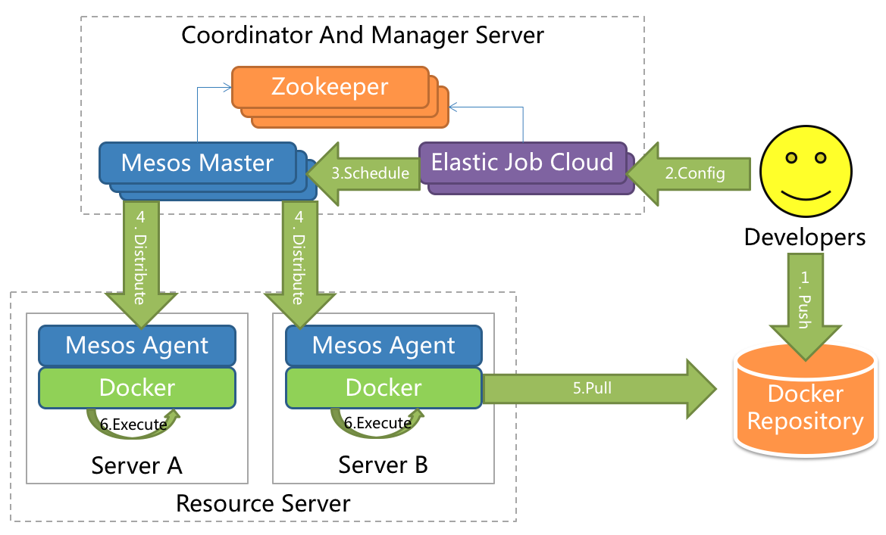

##Elastic-Job - distributed scheduled job solution

# [中文主页](README_cn.md) 
  
# [原1.x版本文档](README_1.x.md)

[](https://travis-ci.org/dangdangdotcom/elastic-job)
[](https://maven-badges.herokuapp.com/maven-central/com.dangdang/elastic-job)
[](https://coveralls.io/github/dangdangdotcom/elastic-job?branch=master)
[](https://github.com/dangdangdotcom/elastic-job/releases)
[](http://www.apache.org/licenses/LICENSE-2.0.html)

# Overview

Elastic-Job is a distributed scheduled job solution. Elastic-Job is composited from 2 independent sub projects: Elastic-Job-Lite and Elastic-Job-Cloud.

Elastic-Job-Lite is a centre-less solution, use lightweight jar to coordinate distributed jobs.
Elastic-Job-Cloud is a Mesos framework which use Mesos + Docker(todo) to manage and isolate resources and processes.

Elastic-Job-Lite and Elastic-Job-Cloud provide unified API. Developers only need code one time, then decide to deploy Lite or Cloud as you want.

# Features

## 1. Elastic-Job-Lite

* Distributed schedule job coordinate
* Elastic scale in and scale out supported
* Failover
* Misfired jobs refire
* Sharding consistently, same sharding item for a job only one running instance
* Parallel scheduling supported
* Job lifecycle operation
* Lavish job types
* Spring integrated and namespace supported
* Web console

## 2. Elastic-Job-Cloud
* All Elastic-Job-Lite features included
* Application distributed automatically
* Fenzo based resources allocated elastically
* Docker based processes isolation support (TBD)

***

# [Roadmap](ROADMAP.md)

# [Release Notes](http://dangdangdotcom.github.io/elastic-job/post/release_notes/)

# Architecture

## Elastic-Job-Lite


***

## Elastic-Job-Cloud



# Quick Start

## Elastic-Job-Lite

### Add maven dependency

```xml
<!-- import elastic-job lite core -->
<dependency>
    <groupId>com.dangdang</groupId>
    <artifactId>elastic-job-lite-core</artifactId>
    <version>${lasted.release.version}</version>
</dependency>

<!-- import other module if need -->
<dependency>
    <groupId>com.dangdang</groupId>
    <artifactId>elastic-job-lite-spring</artifactId>
    <version>${lasted.release.version}</version>
</dependency>
```
### Job development

```java
public class MyElasticJob implements SimpleJob {
    
    @Override
    public void execute(ShardingContext context) {
        switch (context.getShardingItem()) {
            case 0: 
                // do something by sharding item 0
                break;
            case 1: 
                // do something by sharding item 1
                break;
            case 2: 
                // do something by sharding item 2
                break;
            // case n: ...
        }
    }
}
```

### Job configuration

```xml
<?xml version="1.0" encoding="UTF-8"?>
<beans xmlns="http://www.springframework.org/schema/beans"
    xmlns:xsi="http://www.w3.org/2001/XMLSchema-instance"
    xmlns:reg="http://www.dangdang.com/schema/ddframe/reg"
    xmlns:job="http://www.dangdang.com/schema/ddframe/job"
    xsi:schemaLocation="http://www.springframework.org/schema/beans
                        http://www.springframework.org/schema/beans/spring-beans.xsd
                        http://www.dangdang.com/schema/ddframe/reg
                        http://www.dangdang.com/schema/ddframe/reg/reg.xsd
                        http://www.dangdang.com/schema/ddframe/job
                        http://www.dangdang.com/schema/ddframe/job/job.xsd
                        ">
    <!--configure registry center -->
    <reg:zookeeper id="regCenter" server-lists="yourhost:2181" namespace="dd-job" base-sleep-time-milliseconds="1000" max-sleep-time-milliseconds="3000" max-retries="3" />

    <!--configure job -->
    <job:simple id="myElasticJob" class="xxx.MyElasticJob" registry-center-ref="regCenter" cron="0/10 * * * * ?"   sharding-total-count="3" sharding-item-parameters="0=A,1=B,2=C" />
</beans>
```

***

## Elastic-Job-Cloud

### Add maven dependency

```xml
<!-- import elastic-job cloud executor -->
<dependency>
    <groupId>com.dangdang</groupId>
    <artifactId>elastic-job-cloud-executor</artifactId>
    <version>${lasted.release.version}</version>
</dependency>
```
### Job development

Same with `Elastic-Job-Lite`

### Job App configuration

```shell
curl -l -H "Content-type: application/json" -X POST -d 
'{"appName":"yourAppName","appURL":"http://app_host:8080/foo-job.tar.gz","cpuCount":0.1,"memoryMB":64.0,"bootstrapScript":"bin/start.sh","appCacheEnable":true}' 
http://elastic_job_cloud_host:8899/app
```

### Job configuration

```shell
curl -l -H "Content-type: application/json" -X POST -d 
'{"jobName":"foo_job","jobClass":"yourJobClass","jobType":"SIMPLE","jobExecutionType":"TRANSIENT","cron":"0/5 * * * * ?","shardingTotalCount":5,"cpuCount":0.1,"memoryMB":64.0,"appURL":"http://app_host:8080/foo-job.tar.gz","failover":true,"misfire":true,"bootstrapScript":"bin/start.sh"}' 
http://elastic_job_cloud_host:8899/job/register
```
