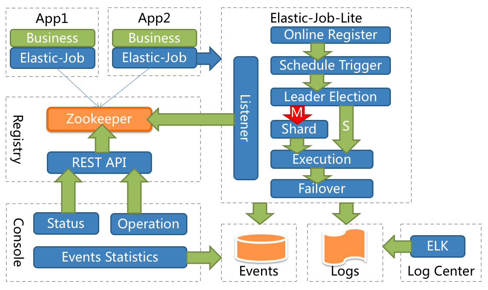

# [ElasticJob - distributed scheduled job solution](http://shardingsphere.apache.org/elasticjob/)

**Official website: http://shardingsphere.apache.org/elasticjob/**

[](https://starchart.cc/apache/shardingsphere-elasticjob-lite)

ElasticJob is a distributed scheduled job solution. 
It is composited from 2 independent sub projects: ElasticJob Lite and ElasticJob Cloud.

ElasticJob Lite is a centre-less solution, use lightweight jar to coordinate distributed jobs.

Elasticjob uses a unified job API for each product. 
Developers only need code one time and can deploy at will.

ElasticJob became an [Apache ShardingSphere](https://shardingsphere.apache.org/) Sub project on May 28 2020.

Welcome communicate with community via [mail list](mailto:dev@shardingsphere.apache.org).

[](https://www.apache.org/licenses/LICENSE-2.0.html)

[](https://github.com/apache/shardingsphere-elasticjob-lite/releases)

[](https://maven-badges.herokuapp.com/maven-central/com.dangdang/elastic-job)
[](https://travis-ci.org/apache/shardingsphere-elasticjob-lite)
[](https://coveralls.io/github/elasticjob/elastic-job?branch=master)

## Architecture

### ElasticJob Lite



## Features

- Elastic Schedule
  - Support job sharding and high availability in distributed system
  - Scale out for throughput and efficiency improvement
  - Job processing capacity is flexible and scalable with the allocation of resources

- Resource Assign
  - Execute job on suitable time and assigned resources
  - Aggregation same job to same job executor
  - Append resources to newly assigned jobs dynamically

- Job Governance
  - Failover
  - Misfired
  - Self diagnose and recover when distribute environment unstable

- Job Dependency(TODO)
  - DAG based job dependency
  - DAG based job item dependency

- Job Open Ecosystem
  - Unify job api for extension
  - Support rich job type lib, such as dataflow, script, HTTP, file, big data
  - Focus business SDK, can work with Spring IOC

- Admin Console
  - Job administration
  - Job event trace query
  - Registry center management

## [Release Notes](https://github.com/elasticjob/elastic-job/releases)

## [Roadmap](ROADMAP.md)

## Quick Start

### Add maven dependency

```xml
<!-- import elastic-job lite core -->
<dependency>
    <groupId>org.apache.shardingsphere.elasticjob</groupId>
    <artifactId>elastic-job-lite-core</artifactId>
    <version>${lasted.release.version}</version>
</dependency>

<!-- import other module if need -->
<dependency>
    <groupId>org.apache.shardingsphere.elasticjob</groupId>
    <artifactId>elastic-job-lite-spring</artifactId>
    <version>${lasted.release.version}</version>
</dependency>
```
### Job development

```java
public class MyElasticJob implements SimpleJob {
    
    @Override
    public void execute(ShardingContext context) {
        switch (context.getShardingItem()) {
            case 0: 
                // do something by sharding item 0
                break;
            case 1: 
                // do something by sharding item 1
                break;
            case 2: 
                // do something by sharding item 2
                break;
            // case n: ...
        }
    }
}
```

### Job configuration

```xml
<?xml version="1.0" encoding="UTF-8"?>
<beans xmlns="http://www.springframework.org/schema/beans"
       xmlns:xsi="http://www.w3.org/2001/XMLSchema-instance"
       xmlns:elasticjob="http://elasticjob.shardingsphere.apache.org/schema/elasticjob"
       xsi:schemaLocation="http://www.springframework.org/schema/beans
                           http://www.springframework.org/schema/beans/spring-beans.xsd
                           http://elasticjob.shardingsphere.apache.org/schema/elasticjob
                           http://elasticjob.shardingsphere.apache.org/schema/elasticjob/elasticjob.xsd
                           ">
    <!--configure registry center -->
    <elasticjob:zookeeper id="regCenter" server-lists="yourhost:2181" namespace="elastic-job" base-sleep-time-milliseconds="1000" max-sleep-time-milliseconds="3000" max-retries="3" />

    <!--configure job snapshot service -->
    <elasticjob:snapshot id="jobSnapshot" registry-center-ref="regCenter" dump-port="9999"/>
    
    <!--configure job class -->
    <bean id="simpleJob" class="xxx.MyElasticJob" />
    
    <!--configure job -->
    <elasticjob:simple id="oneOffElasticJob" job-ref="simpleJob" registry-center-ref="regCenter" cron="0/10 * * * * ?"   sharding-total-count="3" sharding-item-parameters="0=A,1=B,2=C" />
</beans>
```
