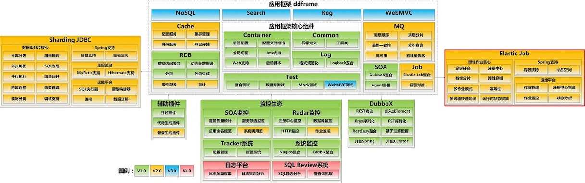

##Elastic-Job - distributed scheduled job solution

  Elastic-Job是ddframe中dd-job的作业模块中分离出来的分布式弹性作业框架。去掉了和dd-job中的监控和ddframe接入规范部分。该项目基于成熟的开源产品Quartz和Zookeeper及其客户端Curator进行二次开发。

  ddframe其他模块也有可独立开源的部分，之前当当曾开源过dd-soa的基石模块DubboX。

  elastic-job和ddframe关系见下图

  

# Release Notes
* elastic-job&nbsp;&nbsp;&nbsp;&nbsp;&nbsp;&nbsp;&nbsp;&nbsp;&nbsp;&nbsp;&nbsp;&nbsp;&nbsp;&nbsp;&nbsp;[](https://maven-badges.herokuapp.com/maven-central/com.dangdang/elastic-job)
* elastic-job-api&nbsp;&nbsp;&nbsp;&nbsp;&nbsp;&nbsp;[](https://maven-badges.herokuapp.com/maven-central/com.dangdang/elastic-job-api)
* elastic-job-core&nbsp;&nbsp;&nbsp;&nbsp;&nbsp;&nbsp;[](https://maven-badges.herokuapp.com/maven-central/com.dangdang/elastic-job-core)
* elastic-job-spring&nbsp;&nbsp;&nbsp;[](https://maven-badges.herokuapp.com/maven-central/com.dangdang/elastic-job-spring)

# License
[](http://www.apache.org/licenses/LICENSE-2.0.html)

# Build Status
[](https://travis-ci.org/dangdangdotcom/elastic-job)
[](https://coveralls.io/github/dangdangdotcom/elastic-job?branch=master)
##主要贡献者
* 张亮 [当当网](http://www.dangdang.com/) zhangliang@dangdang.com
* 曹昊 [当当网](http://www.dangdang.com/) caohao@dangdang.com
* 江树建 [当当网](http://www.dangdang.com/) jiangshujian@dangdang.com

**讨论QQ群：**430066234（不限于Elastic-Job，包括分布式，定时任务相关以及其他互联网技术交流。由于QQ群已接近饱和，我们希望您在申请加群之前仔细阅读文档，并在加群申请中正确回答问题，以及在申请时写上您的姓名和公司名称。并且在入群后及时修改群名片。否则我们将有权拒绝您的入群申请。谢谢合作。）

## Elastic-Job主要功能

### 主要功能

* **分布式：** 重写Quartz基于数据库的分布式功能，改用Zookeeper实现注册中心。

* **并行调度：** 采用任务分片方式实现。将一个任务拆分为多个独立的任务项，由分布式的服务器并行执行各自分配到的分片项。

* **弹性扩容缩容：** 将任务拆分为多个子任务项后，各个服务器分别执行各自分配到的任务项。一旦有新的服务器加入集群，或现有服务器下线，elastic-job将在保留本次任务执行不变的情况下，下次任务开始前触发任务重分片。

* **集中管理：** 采用基于Zookeeper的注册中心，集中管理和协调分布式作业的状态，分配和监听。外部系统可直接根据Zookeeper的数据管理和监控elastic-job。

* **定制化流程型任务：** 作业可分为简单和数据流处理两种模式，数据流又分为高吞吐处理模式和顺序性处理模式，其中高吞吐处理模式可以开启足够多的线程快速的处理数据，而顺序性处理模式将每个分片项分配到一个独立线程，用于保证同一分片的顺序性，这点类似于Kafka的分区顺序性。

### 其他功能

* **失效转移：** 弹性扩容缩容在下次作业运行前重分片，但本次作业执行的过程中，下线的服务器所分配的作业将不会重新被分配。失效转移功能可以在本次作业运行中用空闲服务器抓取孤儿作业分片执行。同样失效转移功能也会牺牲部分性能。

* **Spring命名空间支持：** elastic-job可以不依赖于Spring直接运行，但是也提供了自定义的命名空间方便与Spring集成。

* **运维平台：** 提供web控制台用于管理作业。

### 非功能需求

* **稳定性：** 在服务器无波动的情况下，并不会重新分片；即使服务器有波动，下次分片的结果也会根据服务器IP和作业名称哈希值算出稳定的分片顺序，尽量不做大的变动。

* **高性能：** 同一服务器的批量数据处理采用自动切割并多线程并行处理。

* **灵活性：** 所有在功能和性能之间的权衡，都可通过配置开启/关闭。如：elastic-job会将作业运行状态的必要信息更新到注册中心。如果作业执行频度很高，会造成大量Zookeeper写操作，而分布式Zookeeper同步数据可能引起网络风暴。因此为了考虑性能问题，可以牺牲一些功能，而换取性能的提升。

* **一致性：** elastic-job可牺牲部分性能用以保证同一分片项不会同时在两个服务器上运行。

* **容错性：** 作业服务器和Zookeeper断开连接则立即停止作业运行，用于防止分片已经重新分配，而脑裂的服务器仍在继续执行，导致重复执行。

## 相关文档

[Release Notes](http://dangdangdotcom.github.io/elastic-job/post/1.x/release_notes/)

[1.1.0接口变更声明](http://dangdangdotcom.github.io/elastic-job/post/1.x/update_notes_1.1.0/)

[何为分布式作业？](http://dangdangdotcom.github.io/elastic-job/post/1.x/distribution/)

[目录结构说明](http://dangdangdotcom.github.io/elastic-job/post/1.x/directory_structure/)

[使用步骤](http://dangdangdotcom.github.io/elastic-job/post/1.x/usage/)

[开发指南](http://dangdangdotcom.github.io/elastic-job/post/1.x/user_guide/)

[使用限制](http://dangdangdotcom.github.io/elastic-job/post/1.x/limitations/)

[运维平台](http://dangdangdotcom.github.io/elastic-job/post/1.x/web_console/)

[阅读源码编译问题说明](http://dangdangdotcom.github.io/elastic-job/post/1.x/source_code_guide/)

[实现原理](http://dangdangdotcom.github.io/elastic-job/post/1.x/theory/)

[作业分片策略](http://dangdangdotcom.github.io/elastic-job/post/1.x/job_strategy/)

[作业运行状态监听](http://dangdangdotcom.github.io/elastic-job/post/1.x/execution_monitor/)

[dump作业运行信息（便于开发者debug）](http://dangdangdotcom.github.io/elastic-job/post/1.x/dump/)

[快速上手](http://dangdangdotcom.github.io/elastic-job/post/1.x/quick_start/)（感谢第三方志愿者 泽伟@心探索科技 提供文档）

[InfoQ新闻](http://www.infoq.com/cn/news/2015/09/dangdang-elastic-job)

[InfoQ文章：详解当当网的分布式作业框架](http://www.infoq.com/cn/articles/dangdang-distributed-work-framework-elastic-job)

[Elastic-Job Wiki](https://github.com/dangdangdotcom/elastic-job/wiki) （由社区志愿者自由编辑的）

## Quick Start

* **引入maven依赖**

elastic-job已经发布到中央仓库，可以在pom.xml文件中直接引入maven坐标。

```xml
<!-- 引入elastic-job核心模块 -->
<dependency>
    <groupId>com.dangdang</groupId>
    <artifactId>elastic-job-core</artifactId>
    <version>${lasted.release.version}</version>
</dependency>

<!-- 使用springframework自定义命名空间时引入 -->
<dependency>
    <groupId>com.dangdang</groupId>
    <artifactId>elastic-job-spring</artifactId>
    <version>${lasted.release.version}</version>
</dependency>
```
* **作业开发**

```java
public class MyElasticJob extends AbstractSimpleElasticJob {

    @Override
    public void process(JobExecutionMultipleShardingContext context) {
        // do something by sharding items
    }
}
```

* **作业配置**

```xml
<?xml version="1.0" encoding="UTF-8"?>
<beans xmlns="http://www.springframework.org/schema/beans"
    xmlns:xsi="http://www.w3.org/2001/XMLSchema-instance"
    xmlns:reg="http://www.dangdang.com/schema/ddframe/reg"
    xmlns:job="http://www.dangdang.com/schema/ddframe/job"
    xsi:schemaLocation="http://www.springframework.org/schema/beans
                        http://www.springframework.org/schema/beans/spring-beans.xsd
                        http://www.dangdang.com/schema/ddframe/reg
                        http://www.dangdang.com/schema/ddframe/reg/reg.xsd
                        http://www.dangdang.com/schema/ddframe/job
                        http://www.dangdang.com/schema/ddframe/job/job.xsd
                        ">
    <!--配置作业注册中心 -->
    <reg:zookeeper id="regCenter" server-lists="yourhost:2181" namespace="dd-job" base-sleep-time-milliseconds="1000" max-sleep-time-milliseconds="3000" max-retries="3" />

    <!-- 配置作业-->
    <job:simple id="myElasticJob" class="xxx.MyElasticJob" registry-center-ref="regCenter" cron="0/10 * * * * ?"   sharding-total-count="3" sharding-item-parameters="0=A,1=B,2=C" />
</beans>
```
